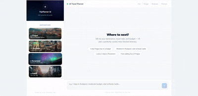

# AI Travel Planner

### Retrieval-Augmented Generation (RAG) + Route Optimization + LLM Planning

An intelligent travel-planning system that generates personalized multi-day itineraries using semantic search, vector databases, route optimization, and large language models.

Instead of asking an LLM to invent a travel plan, this project retrieves real locations from a curated database, groups them geographically, optimizes walking routes, and then generates a coherent itinerary based on user preferences and budget.


---

## Why This Project?

Most AI travel planners suffer from hallucinations and poor route planning.

This project addresses that by combining:

* **RAG (Retrieval-Augmented Generation)** for factual location retrieval
* **ChromaDB** for semantic search
* **K-Means Clustering** for neighborhood grouping
* **OSRM Routing** for realistic walking distances
* **Llama 3.1 (Groq)** for itinerary generation
* **FastAPI** for serving the application

The result is a travel assistant that produces recommendations grounded in real data while minimizing unnecessary travel between attractions.

---

## Architecture

```text
User Query
    ↓
Parameter Extraction (City, Budget, Starting Point)
    ↓
ChromaDB Semantic Search
    ↓
Budget Filtering
    ↓
Geographical Clustering (K-Means)
    ↓
Walking Route Optimization (OSRM)
    ↓
Context Construction
    ↓
Llama 3.1 via Groq
    ↓
Personalized Travel Itinerary
```

---

## Key Features

### Semantic Travel Search

Retrieves relevant attractions based on meaning rather than exact keyword matching.

### Budget-Aware Recommendations

Supports multiple spending profiles:

* Free Only
* Limited Budget
* Standard Budget
* Premium Travel

### Route Optimization

Uses precomputed OSRM walking matrices to minimize travel time between locations.

### Smart Multi-Day Planning

Automatically groups attractions into logical daily itineraries using clustering algorithms.

### Hallucination Reduction

The language model is restricted to locations retrieved from the database.

---

## Tech Stack

| Category        | Technology       |
| --------------- | ---------------- |
| Backend         | FastAPI          |
| Vector Database | ChromaDB         |
| LLM             | Llama 3.1 (Groq) |
| ML              | Scikit-Learn     |
| Routing         | OSRM             |
| Data Processing | NumPy, Requests  |
| Validation      | Pydantic         |

---

## Example Request

```json
{
  "messages": [
    {
      "role": "user",
      "content": "Plan me a 3-day budget trip in Prague starting from Prague Castle."
    }
  ]
}
```

The system:

1. Extracts trip parameters
2. Retrieves matching locations
3. Applies budget constraints
4. Clusters attractions geographically
5. Optimizes walking order
6. Generates a complete itinerary

---

## Running Locally

### Start ChromaDB

```bash
docker run -p 8000:8000 chromadb/chroma
```

### Install Dependencies

```bash
pip install -r requirements.txt
```

### Configure Environment

```env
GROQ_API_KEY=your_api_key
```

### Launch API

```bash
uvicorn app:app --reload
```

API Documentation:

```text
http://localhost:8000/docs
```

---

## Supported Cities

* Prague
* Budapest
* Rovaniemi

The architecture is city-agnostic and can be extended by adding new location datasets and routing matrices.
